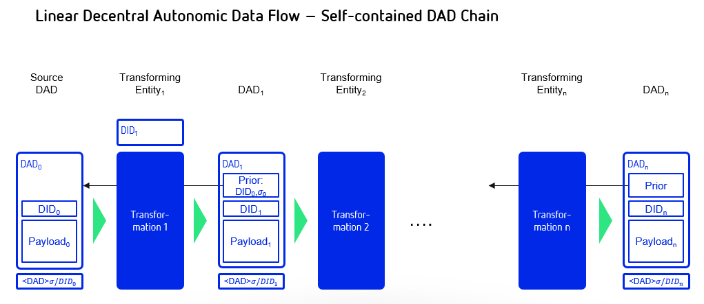
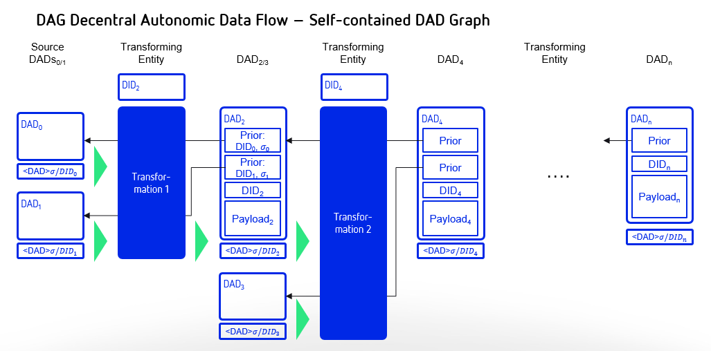
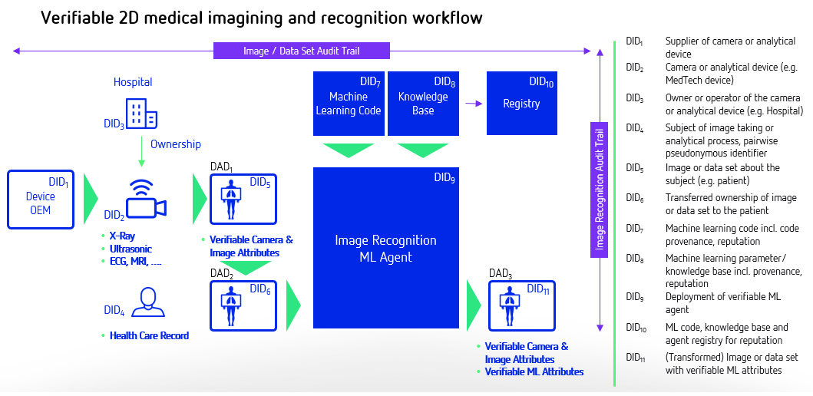

# A DID for Everything

**Attribution, Verification and Provenance for Entities and Data Items**

Presented by [Shaun Conway](mailto:shaun@ixo.world), [Andrew Hughes](mailto:andrewhughes3000@gmail.com), [Moses Ma](mailto:moses.ma@futurelabconsulting.com), [Jack Poole](mailto:jack.w.poole@gmail.com), [Martin Riedel](mailto:martin@civic.com), [Samuel M. Smith Ph.D.](mailto:sam@samuelsmith.org), and [Carsten Stöcker](mailto:carsten.stoecker@interlinked.ai)

Submitted to the 7th Rebooting the Web of Trust Technical Workshop 

September 24-26, 2018, Toronto

Keywords: decentralized identity, Internet of Things, autonomic data, verified claims, identity, blockchain, self-sovereign, fog computing, industry 4.0, digital twinning, data chain provenance, audit trails


## Abstract

The decentralized identifier (DID) is a new and open standard type of globally unique identifier that offers a model for lifetime-scope portable digital identity that does not depend on any centralized authority and that can never be taken away by third-parties [[14]]. DIDs are supported by the W3C community [[14]] and the Decentralized Identity Foundation (DIF) [[16]]. They are the "atomic units" of a new layer of decentralized identity infrastructure. However, DIDs can be extended from identifiers for people to any entity, thus identifying _everything_. We can use DIDs to help us identify and manage objects, machines, or agents through their digital twins; we can expand them to locations, to events, and even to pure data objects, which we refer to as decentralized autonomic data (DAD) items [[1]][[3]]. 

The paper will present novel use-cases for DIDs and DADs and propose a new cryptographic data structure that is a self-contained blockchain of DADs. This enables the verification of the provenance of a given data flow. It builds on a prior paper [[1]] and an associated reading [[2]].

DIDs are only the base layer of decentralized identity infrastructure. The next higher layer (where most of the value is unlocked) is verifiable claims. This is the technical term for a digitally signed electronic data structure that conforms to the interoperability standards being developed by the W3C Verifiable Credentials Working Group [[15]]. When a DID and hence DADs of the resultant data are extended to machines and autonomic data, the provenance chain of the data flow can provide the basis for verifiable claims and attestations about the data flow as well as the basis for a reputation.

## Why This Matters

Today, the Internet is probably best described as a network comprised of all interconnected entities, traditionally referring to human users and computers. When we add connected entities and devices in the so-called Internet of Things (IoT), the number of addressable elements is in the tens of billions, with an estimate of 75 bn connected IoT devices in 2025 [[4]]. Software services, such as algorithms and bots, further extend this universe of identifiable entities.

The resulting combinatorics of possible connections between any given set of entities is an impossibly large number. Yet in today's user journeys or business environments, agents (whether human, machine, or software) increasingly need to communicate, access or transact with a diverse group of these interconnected objects to achieve their goals in both the digital and physical worlds. This requires a straightforward and ubiquitous method to address, verify, and connect these elements together.

**Definition of *Entity*:** Something that has a distinct and independent existence either in the real or the digital world. Examples of an entity are:

*   *Living Organism*
*   *Physical Object*
*   *Locations or Events*
*   *Machines and Devices in the Internet of Things (IoT)* 
*   *Digital Asset, Data Set, or Agent*

Human or object identities are stored in multiple centralised or federated systems such as government, ERP, IoT, or manufacturing systems. From the standpoint of cryptographic trust verification, each of these centralised authorities serves as its own root of trust. 

An entity trailing along a value chain is interacting with multiple systems. Consequently, a new actor in any given value chain has no method to independently verify credentials of a human or attributes of either a physical object or data item (provenance, audit trail). This results in the existence of complex validation, quality inspection, and paper trail processes, and enormous hidden *trust overhead* costs are added to all value chains and services. 

To be a truly global solution, easy to use and still safe from hacking and sovereign interference, such a scheme must include: 

* preservation of privacy
* security from tampering
* reliable trust verification
* assurance of risk
* independence from any vendor-defined naming API 
* one-to-one mappable onto each entity. 

Therefore, a universal addressing, trust-verification system and associated interoperable protocol must be utilised, empowering every form of entity.

### Why it Matters for People

Today when entities want their identities to be confirmed they transfer information such as a birth certificate, physical address, or social security number to multiple third parties, who start to validate the same data in different contexts for KYC and authentication processes. 

The parties to which they sent that information retains it, meaning the data is out there in silos, creating risks in terms of data loss, privacy breaches, and use of inconsistent data and forcing companies that might not want to be in that position to store that information. It also enables businesses to harvest people's personal data for commercial purposes,  which does not necessarily reflect the intentions of the individual people.

This situation results in big problems for humans such as broken health care records. Patients will need a universally addressable healthcare record system that is controlled by the patient itself, that consistently stores all relevant verified health care data, and that is able to share this data with doctors that need to connect with it. To enable the doctors or algorithms, they need a data-flow provenance to verify the integrity, quality, or reputation of a healthcare record to decide on treatments and give the patient confidence about the proposed treatments.  

### Why it Matters for Businesses

**Definition of a *Digital Twin*:** A digital twin is a digital representation of either a real-world or digital entity. A digital twin exists over the life-cycle of an entity from planning, manufacturing, testing, birth, and operations to decommissioning and reuse. The more past and present data are related and analysed, the more knowledge can be deployed to drive significant improvements on an individual entity or system level. 

It is estimated that by 2022 the IoT powered by digital twins will save consumers and businesses worth $1 trillion a year in asset maintenance [[5]].

The notion of digital twinning for objects, machines, and agents is becoming relevant to an increasing number of human services and Industry 4.0 use cases. This is the result of the growth in digital services, connections, and data streams from the Internet of Things (IoT) devices that increasingly drive integration with machine learning algorithms, resulting in graph-type data chains for processing the IoT data streams.

Today, digital twins are captured in siloed, proprietary IoT solutions by individual corporates that do not own the physical object over the life-cycle and even do not interact with parties using the object further down a value chain. Decentralized solutions are liberating the digital twins from silos and establishing more valuable and interoperable verifiable attributes about entities and the data chains they connect with.

### Why it Matters for Objects, Machines and Agents

There is no widely adopted authentication or verification systems in place to provide the equivalent of KYC (know-your-customer) for non-human entities, that is:  KYA (know-your-agent), KYB (know-your-bot), KYM (know-your-machine), or KYO (know-your-object).

In a world when objects and machines are connected with datastreams and intelligent agents that perform transaction on behalf of the entity, the number of agent-to-agent transactions will outgrow the number of human transactions by many orders. An agent transacting with another party can independently verify the identifier of the this party, its attributes, and the provenance of the data sets that are involved in the transaction.

Digital twins of 3D-printed objects for safety critical parts such as a turbine of an airplane provide an important example. For these parts, it is important to have an precise audit trail about the 3D printing process to prove that the object was manufactured in accordance to stringent specifications. The digital twin stores design, manufacturing, post processing, and quality-assurance data about the 3D-printed object. These data are coming from multiple systems resulting in a variety of data chains. With DIDs and DADs the integrity of the data chains can be verified. The verification of the datachains and the underlying data results in important proofs about the provenance of 3D printed object.  

### Why it Matters for the World

The diverse application of decentralized identifiers (DIDs) will have substantial influences in broader applications on a global scale. The seamless provenance of physical objects or data items through any value chain has major implications on the risk and value properties of the processed data.

Within any dynamic process, participating entities have substantial interest in the authenticity and trustworthiness in any individual step. Data that is accumulated with an unforgeable audit trail that references decentralized identifying information (Person, Device or any other Entity) for any transformation step holds greater value then it would have without such properties.

Managing the sustainability of the commons requires mechanisms to value natural capital and to account for the externalities that arise from human activities. This should attribute extractions from and contributions to the commons by organisations, organisms, machines and information. We need to identify these entities and must identify both positive and negative impacts these entities are having on the commons. Knowing what these impacts are enables us to count what matters and to put a value on what counts. 

The promise of a overarching prevalence through the broad use of DIDs also provides the key component for achieving the vision of a *circular economy*: a regenerative system in which resource input and waste, emission, and energy leakage are minimized by slowing, closing, and narrowing energy and material loops. This can be achieved through long-lasting design, maintenance, repair, reuse, remanufacturing, refurbishing, recycling, and upcycling. This contrasts with a linear economy, which is a self-destructing, catastrophic 'take, make, dispose' model of production.

## Comprehensive Solution

### Motivation

The Decentralized Autonomic Data paper from the RWOT Spring 2018 introduced three new concepts related to DIDs [[1]]. 

*   Decentralized Autonomic Data (DADi) items
*   Derived DID (dDID)
*   Self-contained verification of data governance and integrity. 

This paper extends these concepts with a new one, that is,

*   Data flows may be provenanced via a self-referential blockchain (list of signed DAD items where each subsequent DAD item includes the DID or dDID and associated signature of the previous item)

### Data Provenance

The concepts above lay the groundwork for *data-flow provenance* that is the focus of this paper. In this context *provenance* is used in a general sense. By *data-flow provenance* we mean a mechanism for tracing data-item content and control through a processing system, including any transformations to the data item or its governance. This includes flows with multiple sources and sinks of data, independently and in combination. To restate, *data-flow provenance* means not just tracing control but also verifying the end-to-end integrity of every data flow, including any transformations (additions, deletions, modifications, and combinations).

In this context provenance refers to the *chain-of-custody* of data items not ownership. Ownership is a more complex idea than mere control. Change of ownership requires the previous owner to relinquish ownership and the new owner to accept ownership. It reverts back if not accepted. Finally, ownership implies a restriction or limitation on rights so it may need to be interactive or involve a third party.

In English we use the term "*custody*" to refer to having possession of something (under you control), but custody does not equal ownership.
With physical objects one can have unique custody that could be equivalent to ownership because a physical object is a unique thing. Hence the expression "possession is nine-tenths of the law" [[17]]. Because data can be easily duplicated, however, it may not be possible to prove unique possession of data. There is no way to guarantee that there is not another copy of the data. So custody of data is not equivalent to restricted ownership. With data the strongest attestation of ownership is limited to merely rights to use the data. So transfer of ownership of data is a different concept; it's not transfer of the data itself but the transfer of rights to use the data.  

An important insight from the viewpoint of a distributed application is that an entity's influence on the application is solely based on the digital data flows that move between the entity and the other components of the distributed application.  We choose to call those data flows the entity's _projection_ onto the distributed application. If those projections consist of DADs and every interaction of internal components consists of DADs then we have a universal approach for implementing decentralized applications with total  provenance of control and data within the application.

A major motivation for establishing data-flow provenance is to support building and architecting decentralized processing systems that use a *zero-trust* or more correctly *diffuse-trust perimeterless security* model.  The emerging decentralized processing paradigm for distributed applications where the sources and sinks of data may be controlled by multiple entities, i.e. decentralized governance, means that traditional perimeter security models are at best problematic. Indeed, even the newer  perimeterless security model as originally formulated assumes singular governance of the network hosts and associated data [[7]][[8]]. We extend that model herein to include hosts and DADs with decentralized governance via DIDs. 

An earlier paper explored the architectural issues of building distributed computing infrastructure that applied the *zero-trust* security model but extended it to use distributed consensus for policy governance [[9]]. This type of architecture we called *Zero-Trust-Computing* or more correctly *Diffuse-Trust-Computing*. A simple way of explaining the zero-trust security model is the mantra, "never trust, always verify". The paradigm of Zero Trust Networking was first popularized in 2013 by a NIST report [[7]]. More recently the principles have received much broader attention including the book *Zero Trust Networks* [[8]]. The basic approach to *Diffuse-Trust-Computing* is to use a diffuse trust perimeterless security approach. As previously mentioned, some call this a trustless or zero-trust security model but that is a misnomer. There is still trust, it is just diffused in such a way that security is greatly enhanced [[9]]. In this paper we further extend that model to use DIDs and DADs to provide decentralized end-to-end data provenance.

The caveats of conventional diffuse-trust perimeterless security are:

*   The network is always hostile both internally and externally; locality is not trustworthy.
*   By default, every network interaction or data flow must be authenticated and authorized using best practices cryptography.
*   By default, inter-host communication must be end-to-end signed/encrypted, and data must be stored signed/encrypted using best practices cryptography; Data is signed/encrypted at motion and at rest.
*   Policies for authentication and authorization must be dynamically modified based on behavior (reputation).

Using end-to-end encryption and storage prevents exploits from anyone that merely has access to the network or the data-storage device. By authenticating and authorizing every network interaction or data flow, security becomes granular. A successful exploit of one interaction does not bleed into any other. Compromising one data flow does not compromise any other. Escalation opportunities are minimized. Many security exploits are discovered through repeated probes and experiments to find bugs, buffer overflows, or weaknesses in network protocols or software implementations. Dynamic policy modification that uses AI to first profile and detect anomalous behavior and then restrict the authorization of that user prevents discovery. This adds time as a defence.

Extending the model to enhance the security of the policy management adds the following caveat:

*   Policies must be governed by distributed consensus.

Distributed consensus diffuses the trust for any policy decision to a group of hosts. In order to defeat the policy, an attacker must exploit some majority of the hosts. This makes exploits exponentially more difficult. Distributed consensus also allows for decentralized governance of the hosts.

This paper extends these principles with one more:

*   By default, each data flow including transformations must be end-to-end provenanced using decentralized identifiers (DIDs) and hence decentralized autonomic data items (DADis).

This additional principle allows governance over the data using a decentralized trust model and a decentralized web of trust based on DIDs and DADis. This approach enables truly decentralized governance models for distributed applications. One can combine the third and sixth caveats from above, to a simple summary cavet: 

*   By default, data flows are end-to-end  provenanced/signed/encrypted at motion and at rest using DIDs and DADis.

This remainder of this section in the paper will explore salient issues in using DIDs and DADs to maintain provenance over each step in a data processing flow including transformations of the data to enable credible uses of the data for various applications while maintaining a zero or difuse-trust security model.

### Decentralized Autonomic Data

#### Definition

First introduced in more detail here [[1]], a decentralized autonomic data item (DADi) is associated with a decentralized identifier [[14]]. This paper does not provide a detailed definition of DIDs but does describe how DIDs are used by a DADi. The DID syntax specification is a modification of standard URL syntax per RFC-3986 [[19]]. As such, it benefits from familiarity, which is a boon to adoption. One of the features of a DID is that it is a self certifying identifier in that a DID includes either a public key or a fingerprint of a public key from a cryptographic public/private key pair. Thereby a signature created with the private key can be verified using the public key provided by the DID. The inclusion of the public part of a cryptographic key pair in the DID gives the DID other desirable properties. These include universal uniqueness and pseuodnynmity. Another way to describe a DID is that it is a cryptonym: a cryptographically derived pseudonym.

In the DAD acronym, *decentralized* means that the governance of the data may not reside with a single party. The term *autonomic* means self-managing or self-regulating. In the context of data, we crystalize the meaning of self-managing to include cryptographic techniques for maintaining data provenance that make the data self-identifying, self-certifying, and self-securing. Implied thereby is the use of cryptographic keys and signatures to provide a root of trust for data integrity and to maintain that trust over *change-in-custody* and *transformation* of that data, i.e. *provenance*. 

The motivating use of DAD is to provide provenance for streaming data that is generated and processed in a distributed manner with decentralized governance. Streaming data are typically measurements that are collected and aggregated to form higher level constructs. Applications include analytics and instrumentation of distributed web or internet-of-things (IoT) applications as well as portable reputation systems. A DAD seeks to maintain a provenance chain for data undergoing various processing stages that follows diffuse trust security principles including signed at rest and in motion.

Streaming data applications may impose significant performance demands on the processing of the associated data.

Associated with a DID is a DID Document (DDO) [[14]]. The DDO provides meta-data about the DID that can be used to manage the DID as well as discover services affiliated with the DID. Typically the DDO is provided by a DID resolution service. The DID/DDO model is not a good match for streaming data especially if a new DID/DDO pair would need to be created for each new DAD item. But a DID/DDO is a good match when used as the root or master identifier from which an identifier for the DAD is derived. This derived identifier is called a *derived-DID* or dDID. Thus only one DID/DDO paring is required to manage a large number of DADs where each DAD may have a unique dDID. The syntax for a dDID is identical for a DID. The difference is that only one DDO with meta-data is needed for the root DID used to create the dDIDs in the DADs. Each DAD item carries any additional DAD-specific meta-data, thus making them self-contained (autonomic).

#### DID Syntax

A DID or dDID has the following required syntax:


```
did:method:idstring
```

The _method_ is some short string that namespaces the DID and provides for unique behavior in the associated method specification. In this paper we will use the method _dad_.

The  _idstring_ must be universally unique. The _idstring_ can have multiple colon ":" separated parts, thus allowing for namespacing. In this document the first part of the _idstring_ is linked to the public member of a cryptographic key pair that is defined by the method. We will use a 44-character Base64 URL-File safe encoding as per RFC-4648 [[18]], with one trailing pad byte of the 32-byte public verification key for an EdDSA (Ed25519) signing key pair. Unless otherwise specified Base64 in this document refers to the URL-File safe version of Base64. The URL-File safe version of Base64 encoding replaces plus "+" with minus "-" and slash "/" with underscore "_". A DID may have optional parts including a path, query, or fragment. These use the same syntax as a URL, that is, the path is delimited with slashes, _/_, the query with a question mark, _?_, and the fragment with a pound sign, _#_. When the path part is provided then the query applies to the resource referenced by the path and the fragment refers to an element in the document referenced by the path. An example follows:


```
did:dad:Xq5YqaL6L48pf0fu7IUhL0JRaU2_RxFP0AL43wYn148=/mom?who=me#blue
```

In contrast, when the path part is missing but either the query or fragment part is provided then the query and/or fragment parts have special meaning. A query without a path means the the query is an operation on either the DID itself or the DID document (DDO). Likewise when a fragment is provided then the fragment is referencing an element of the DDO. An example of a DID without a path but with a query follows:

```
did:dad:Xq5YqaL6L48pf0fu7IUhL0JRaU2_RxFP0AL43wYn148=?who=me
```

As will be described later, a query part on a DID expression without a path part will enable the generation of dDIDs (derived DIDs).

DIDs form a new class of identifiers that can be used to replace the identifiers commonly used in distributed applications. DIDs can replace UUIDs, URLs, and Public Keys because a DID combines the desirable features of all three identifier classes.

*   UUID:  A Universally Unique Identifier per  RFC 4122 has  types 1-5. These are 16-byte collision-resistant decentralized identifiers generated with a pseudo-random-number generator and optional name-spacing data. A UUID enables distributed applications to create unique identifiers without central authority. Prefixed name-spacing allows for sorting and  searching properties such as time order, lexical order, nesting etc.
*   URI:  A Uniform Resource Identifier (URI),  Uniform Resource Locator( URL),  Uniform Resource Name (URN) per   RFC 3986 is of the form scheme:[//[user[:password]@]host[:port]][/path][?query][#fragment]. This provides not just an identifier but namespacing authority and a mini-language for performing operations on the identifier and associated resources.
*   Decentralized Self-Certifying Identifier:   A Self-Certifying Identifier contains the fingerprint of a public member of cryptographic public/private key pair. A decentralized Self-Certifying Identifier contains the fingerprint of a public/private key pair that is generated by the user not a central registry. A Hierarchical Deterministic Self-Certifying Identifier of the form  selfcertroot:/path/to/related/data provides a way to reproduce private keys without having to store them. 
*   Tupleizable Identifier. A tupleizable identifier  of the form (channel, host, process, data) tenables a routing overlay on top of IP that can be provenanced.

Indeed any computing infrastructure that is now using UUIDs and URLs could beneficially replace them with DIDs.

#### Minimal DAD

A minimal DAD (decentralized autonomic data) item is a data item that contains a DID or dDID that helps uniquely identify that data item or affiliated data stream. In this paper JSON is used to represent serialized DAD items but other formats could be used instead. To ensure non-repudiable data integrity (i.e. that the data has not been tampered with and can be assigned to a given signing entity) a signature is appended to the DAD item that is verifiable as being generated by the private key associated with the public key in the _id_ field value. This signature verifies that the DAD item was created by the holder of the associated private key. The DAD item is thereby both self-identifying and self-certifying because the identifier value given by the _id_ field is included in the signed data and is verifiable against the private key associated with the public key obtained from the associated DID in the _id_ field. The signature is separated from the JSON serialization with characters that may not appear in the JSON. An example DAD with a payload follows:

```
{
    "id": "did:dad:Xq5YqaL6L48pf0fu7IUhL0JRaU2_RxFP0AL43wYn148=",
    "data":
    {
        "name": "John Smith",
        "nation": "USA"
    }
}
\r\n\r\n
u72j9aKHgz99f0K8pSkMnyqwvEr_3rpS_z2034L99sTWrMIIJGQPbVuIJ1cupo6cfIf_KCB5ecVRYoFRzAPnAQ==
```

As previously mentioned, the motivating use case of DADs is to support distributed streaming data applications. These could entail the creation of a large number of DIDs thus simplifying the reproduction of the associated public/private key pairs is an important consideration. One way to accomplish this is with a deterministic procedure for generating new public/private keys pairs where the private keys may be reproduced securely from some public information without having to be stored. A hierarchically deterministic (HD) key-generation algorithm does this by using a master or root private key and then generating new key pairs using a deterministic key-derivation algorithm. A derived key is expressed as a branch in a tree of parent/child keys. Each public key includes the path to its location in the tree. The private key for a given public key in the tree can be securely regenerated using the root private key and the key path, also called a chain code. Only one private key, the root, needs to be stored.

The query part of the DID syntax may be used to represent an HD chain code for an HD key that is derived from a root DID. This provides an economical way to specify derived DIDs (dDIDs) that are used to identify DADS. An example follows:

```
did:dad:Xq5YqaL6L48pf0fu7IUhL0JRaU2_RxFP0AL43wYn148=?chain=0\1\2
```

The expression above discloses the root public DID as well as the key derivation path via the query part. For the sake of brevity this will be call an extended DID. The actual derived dDID is created by applying the HD algorithm with the result:


```
did:dad:Qt27fThWoNZsa88VrTkep6H-4HA8tr54sHON1vWl6FE=
```

Thus a database of dDIDs could be indexed by dDID expressions with each value being the extended DID. Looking up the extended DID allows the holder to recreate on the fly the associated private key for the dDID without ever having to store the private key. An entry in the database might look like the following:

```
{
    "did:dad:Qt27fThWoNZsa88VrTkep6H-4HA8tr54sHON1vWl6FE=":    "did:dad:Xq5YqaL6L48pf0fu7IUhL0JRaU2_RxFP0AL43wYn148=?chain=0\1\2",
   ... 
}
```

The namespacing of the DID idstring also provides information that could be used to help formulate an HD path to generate a dDID. The following example shows two different dDIDs using the same public key and the same chain code but with a different extended idstring.

```
did:dad:Xq5YqaL6L48pf0fu7IUhL0JRaU2_RxFP0AL43wYn148=:blue?chain=0/1
did:dad:Xq5YqaL6L48pf0fu7IUhL0JRaU2_RxFP0AL43wYn148=:red?chain=0/1
```

Some refinements to this approach may be useful. One is the granularity of dDID allocation. A unique dDID could be used for each unique DAD or a unique dDID could be used for each unique destination party that is receiving a data stream. In this case each DAD would need an additional identifier to disambiguate each DAD sent to the same party. This can be provided with an additional field or by using the DID path part to provide a sequence number. This is shown in the following example:

```
did:dad:Qt27fThWoNZsa88VrTkep6H-4HA8tr54sHON1vWl6FE=/10057
```

The associated DAD is as follows:

```
{
    "id": "did:dad:Qt27fThWoNZsa88VrTkep6H-4HA8tr54sHON1vWl6FE=/10057",
    "data":
    {
        "temp": 50,
        "time": "12:15:35"
    }
}
\r\n\r\n
u72j9aKHgz99f0K8pSkMnyqwvEr_3rpS_z2034L99sTWrMIIJGQPbVuIJ1cupo6cfIf_KCB5ecVRYoFRzAPnAQ==
```

#### Change Detection

Stale DAD items must often be detectable to prevent replay attacks. A later re-transmission of an old copy of the DAD item must not supercede a newer copy. Using a sequence number or some other identifier could provide change detection. Another way to provide change detection is for the DAD item to include a _changed_ field whose value is monotonically increasing and changes every time the data is changed. The source of the data can enforce that the _changed_ field value is monotonically increasing. Typical approaches include a monotonically increasing date-time stamp or sequence number. Any older data items resent or replayed would have older date-time stamps or lower sequence numbers and would thus be detectable as stale.

Below is an example of an non-trivial data item that has a _changed_ field for change detection.

```
{
    "id": "did:dad:Qt27fThWoNZsa88VrTkep6H-4HA8tr54sHON1vWl6FE=/10057",
    "changed" : "2000-01-01T00:00:00+00:00",
    "data":
    {
        "temp": 50,
        "time": "12:15:35"
    }
}
\r\n\r\n
u72j9aKHgz99f0K8pSkMnyqwvEr_3rpS_z2034L99sTWrMIIJGQPbVuIJ1cupo6cfIf_KCB5ecVRYoFRzAPnAQ==
```

Change detection prevents replay attacks in the following manner. A second party receives DAD updates that are each signed by the associated private key. Each update has a monotonically increasing changed field. The source signer controls the contents of the data wrapped by the signature. Therefore the signer controls any changed field. A consistent signer will use a monotonically increasing changed value whenever the data wrapped by the signature is changed. Thus a malicious third party cannot replay earlier instances of the DAD wrapped by a valid signature to the original second party because the second party knows to discard any receptions that have older changed fields than the latest one they have already received.

#### On the Fly dDIDs in DADs

One important use case for dDIDs in DADs is to identify data that is received from a source that is not providing identifying information with the data. The receiver then creates an associated DID and dDIDs to identify the data. At some later point the receiver may be able to link this data with some other identifying information or the source may "claim" this data by supplying identifying information. In this case the dDIDs are private to the receiver but can later be used to credibly provenance the internal use of the data. This may be extremely beneficial when shared amongst the entities in the processing chain as a way to manage the entailed proliferation of keys that may all be claimed later as a hierarchical group. The DIDs and associated derivation operations for dDIDS may be shared amongst a group of more-or-less trusted entities that are involved in the processing chain.

#### Data-uniqe dDIDs 

Every DAD MUST have a unique DID. A database of DADs could be addressable by either their DID or their signature as for content-addressability. It might happen that an entity accidentally uses a public private key pair to create a dDID and use it two or more times. One way to ensure uniqueness is to use a random number as UUID or a timestamp and concatenate it as an extension in the DID path. 

```
did:dad:Qt27fThWoNZsa88VrTkep6H-4HA8tr54sHON1vWl6FE=/UUID
```

Another way would be to use the signature in a content-addressable database to resolve the DAD. 

#### Public Derivation

Another important use case for dDIDS in DADS is to avoid storing even the dDID with its derivation chain. This may be an issue when a client wishes to communicate with a potentially very large number of public services. Each public service would be a new pairing with a unique dDID. If the derivation algorithm for an HD-Key dDID could use the public key or public DID of the public service to generate the dDID then the client need not store the actual dDID but can recover the dDID by using the public DID of the server to re-derive the associated dDID. This can be done by creating a hash of the root DID private key and the remote server public DID to create the seed used to generate the dDID for the DAD. This also means that the dDIDs or chain codes do not have to be included in the keys preserved by a key-recovery system.

### Chaining DADs

The provenance of data in a data flow through a data processing system with transformation can be established by forming a literal block chain of the data. When using DAD items to represent the data, the chain of DADs can be represented simply in a self-contained manner. At each step in the data flow of the originating DAD,  where the contained data is transformed in any way, a new DAD is generated by the controlling entity of the transformation. This entity assigns a new DID (or dDID) to this DAD. The new DAD payload includes the DID of the DAD prior to transformation as well as the signature of the prior DAD. This links the new DAD to the prior DAD. The signature of the prior DAD provides both a hash that establishes the content integrity of the prior DAD as well a non-repudiation of the controller of the embedded prior DID. All the DADs in the data flow need to be stored some place indexed by their DIDs. Given this storage, any single DAD can then be used to recall the string of prior DADs back to the originating DAD or DADs.  A special case is when an entity merely wishes to establish custody of data without changing or transforming it. The simplest way to to this that the entity adds a copy of the DAD as a link in the DAD chain without changing the underlying data. This forms an assertion that they control that link.  If they do not transform the data then merely signing is enough to assert control over the link or equivalenty custody of the the data for that link of the chain. A one to many data stream is just a branch or fork in the chain into multiple chains.

An example of an originating DAD and transformed DAD follows:

**Originating:**

```
{
    "id": "did:dad:Qt27fThWoNZsa88VrTkep6H-4HA8tr54sHON1vWl6FE=/alpha/10057",
    "changed" : "2000-01-01T00:00:00+00:00",
    "data":
    {
        "temp": 50,
        "time": "12:15:35"
    }
}\r\n\r\n
u72j9aKHgz99f0K8pSkMnyqwvEr_3rpS_z2034L99sTWrMIIJGQPbVuIJ1cupo6cfIf_KCB5ecVRYoFRzAPnAQ==
```

**Transformed:**


```
{
    "id": "did:dad:AbC7fThWoNZsa88VrTkep6H-4HA8tr54sHON1vWl6FE=/beta/10057",
    "changed" : "2000-01-01T00:00:02+00:00",
    "data":
    {
        "temp": 50,
        "humid": 87,
        "time": "12:15:37"
           }
 "prior", 
         {
                "id":  "did:dad:Qt27fThWoNZsa88VrTkep6H-4HA8tr54sHON1vWl6FE=/alpha/10057",
               "sig": u72j9aKHgz99f0K8pSkMnyqwvEr_3rpS_z2034L99sTWrMIIJGQPbVuIJ1cupo6cfIf_KCB5ecVRYoFRzAPnAQ==

}\r\n\r\n
wbcj9aKHgz99f0K8pSkMnyqwvEr_3rpS_z2034L99sTWrMIIJGQPbVuIJ1cupo6cfIf_KCB5ecVRYoFRzAPnAQ==
```

This approach is then repeated until the data flow reaches the final consumer or sink of the data as shown in the following diagram.


  
In the case where multiple data flows are aggregated or combined in some way such as a moving average or some type of statistical operation then the resultant DAD payload would include a list of the contributing or combined prior DADs. An example follows:

Combined:

```
{
    "id": "did:dad:AbC7fThWoNZsa88VrTkep6H-4HA8tr54sHON1vWl6FE=/gamma/10057",
    "changed" : "2000-01-01T00:00:03+00:00",
    "data":
    {
        "Avg temp": 55,
        "time": "12:15:39"
  }
      "priors", 
         [
           {
                "id":  "did:dad:Qt27fThWoNZsa88VrTkep6H-4HA8tr54sHON1vWl6FE=/alpha/10057",
               "sig": u72j9aKHgz99f0K8pSkMnyqwvEr_3rpS_z2034L99sTWrMIIJGQPbVuIJ1cupo6cfIf_KCB5ecVRYoFRzAPnAQ==
      },
{
                "id":  "did:dad:WA27fThWoNZsa88VrTkep6H-4HA8tr54sHON1vWl6FE=/beta/10058",
               "sig": j78j9aKHgz99f0K8pSkMnyqwvEr_3rpS_z2034L99sTWrMIIJGQPbVuIJ1cupo6cfIf_KCB5ecVRYoFRzAPnAQ==
      },
]
}\r\n\r\n
dy3j9aKHgz99f0K8pSkMnyqwvEr_3rpS_z2034L99sTWrMIIJGQPbVuIJ1cupo6cfIf_KCB5ecVRYoFRzAPnAQ==
```

This can be extended to any arbitrarily complicated tree of processing transformations as shown in the following diagram.



Because each DAD embeds a DID and is signed by the associated private key belonging to the DID, provenance of both the controller of the transformation step and the integrity of the associated data can be determined.  Because each subsequent DAD in a processing flow or DAD chain contains the DID and signature of the prior DAD or DADs, full traceability can be established back to the originating DAD or DADs, preserving both data integrity and proof of control.  This then is a critically enabling capability for decentralized computing infrastructure.

A few open source projects are providing support of the key management needed for building applications with DIDs and DADs. Notable are the Didery Service [[10]] with web [[11]] and command line [[12]] clients and the SeedQuest [[13]] key-recovery application.

## Use Cases

### General

When working with people, the proposed system could use proximity verification, implemented with software toolkits such as Google Nearby and p2pkit, to bind virtual identities to real people. This could be useful in many situations. For example, if two people met over Craigslist to sell a used bicycle, then the system could verify that the two parties actually met and transacted. If two people found each other through a dating site, and followed up with a face to face meeting, then the system could verify that these people were actually in the stated city and not catfishers from Ukraine or Nigeria. Similarly, transactional events could build trust in a similar manner for machines. For example, a certified mechanic performing a tune up on a car with a digital twin can also provide an attestation for the DID for that automobile. A complete history of the automobile's maintenance would add value for its owner.

It should be noted that a single instance of meeting is not as trustable as an entire history of meeting many people. For a state actor generating a legend for a sockpuppet, this would entail an unattainable level of work to prove personhood. For a regular human being, it's relatively effortless to use the system in an organic and unobtrusive manner. Furthermore, these histories of meetings and verifications — using location data to prove it was not in Nigeria, and time data to prove it wasn't in the middle of the night — would be aggregated to increase the trustability of the personhood assessment.

Every resource that is reference by a URL could instead be referenced by a DID or dDID.

*   IoT: Data Stream: DID for Data Stream / DID for individual packaging / DID for Data Transformation (Signature of on old data generator + Signature of transformer) → Storing Transformations in a "Blockchain"
*   DID for API Endpoints: Discovery / Authentication / Transformation.
*   DID as UUID replacement: Unique Identifier + Properties of Self-Certification
*   DID as Resource Identifier Replacements: Derived DIDs
*   Devices: Pacemaker
*   Software Oracles: Stock prices from an exchange 
*   Chatbots: Automated issue-management system
*   Robotic Controllers: Car windscreen-wiper motors
*   Locations: The place where two people met
*   Software applications: Online gaming platform
*   Sensors: Thermostat measuring the ambient temperature in a home
*   Messaging: Peer-to-peer chat application
*   Machines: Wind turbine generating clean energy
*   Digital Media: Video recording of a news report
*   Store of value: Bank account
*   Software containers
*   Microprocessors: Computational cloud server
*   Validator nodes: A blockchain network
*   Databases: Personal Healthcare Record
*   Events
*   [Future] Biological molecule: CRISPR gene therapy
*   An array or matrix of other DIDs

### Use Case: Medical Imaging Workflow

Image processing is operational in many scientific and engineering disciplines. These include:

* Image processing methods are used to count, measure, inspect, and analyse objects, coded information, and/or visual patterns. 
* X-ray and ultrasonic devices deliver medical images with image processing that the doctor or medical algorithm can interpret more easily. 
* X-ray machines in security zones automatically inspect luggage and clothing for dangerous objects. 
* Visual image processing for quality assurance of objects in manufacturing systems.
* Radar and visual images for earth-observation applications.

Image processing can include multiple data sources, parties, algorithms, and processing steps. An image processing end-user needs to be able to validate trustability and accuracy of an image data chain output data. This requirements becomes of critical importance when the output data is used in safety or security-relevant use cases or to make economic decision with significant commercial values involved.
 
The cryptographic DAD data structures enable a user to validate the provenance of an image processing data chain including the authenticity and integrity of the input data and the provenance of the processing algorithms. We recommend the creation of DAD verifiable data chains for image processing that provide a DID for every image and data processing output data set. These data chains are then integrated with DID registries and/or digital twins that provide information about organisations, imaging devices, external data sources, and software algorithms involved in the data chain.

This approach is of particular value when validation or benchmarking data are available about the image devices and the algorithms that are processing the images. In combination with a reputation or validation system any user can calculate trustability and accuracy metrics about the output data.
 
In context of the medical image processing use case, the digital twins of the imaging device include verifiable claims issued by the OEM about the authenticity, accuracy, and calibration of the camera as well as benchmarking information about the accuracy of the machine learning algorithms. The following diagram provides a notional example of a DAD-chain for image processing data provenance.



### Use Case: Proof of Personhood 

The root use case is to help us identify and manage our identity interactions with other people. But to do so more effectively, we need to know that an identifier is accurately associated with an actual person. The fraudulent misuse of identity has a significant negative impact on society. At an individual level, fraudulent users could cheat others in commercial transaction, become catfishers on dating sites, or worse. At a societal level, the fraudulent misuse of identity through  bots and sockpuppets have caused havoc in elections and through the manipulation of public opinion through weaponized propaganda. 

The highest purpose of the blockchain is as a kind of "truth machine". For decentralized identity to succeed, and not be co-opted as just another way to empower sockpuppets and botnets, there needs to be an equivalent to proof-of-work, a mechanism that binds physical entities to virtual identities in a way that enables accountability while preserving anonymity. This is now being referred to as "proof of personhood".

One use case would be to use proximity verification, implemented with software toolkits such as Google Nearby and p2pkit, to bind virtual identities to real people, in a way that preserves privacy, non-correlation, zero-knowledge proofs, and pseudonymous operations. We're currently building a technology called Not_a_Bot, which provides proof of personhood through a variety of techniques. One technique is to verify that the user has actually met another actual person, in physical space… and is not a catfisher, not a scammer, and "not a bot". 

It should be noted that a single instance of meeting is not as trustable as an entire history of meeting many people. For a state actor generating a legend for a sockpuppet, this would entail an unattainable level of work to prove personhood. For a regular human being, it's relatively effortless to use the system in an organic and unobtrusive manner. 

Once a root personhood verification could be insured, then trustable pseudonyms could be generated. Adding this verification to DIDs would provide trust in a trustless environment, as the DID could then provide identity and credentialing services in environments that support, or even require, pseudonymity. 

### Decentralized Fog Computing Infrastructure

The coming tidal wave of digital data due to the proliferation of digital devices will require an exponential increase in computing capacity for data integration and analysis. Currently data integration and analysis is handled predominantly in the cloud. This is not efficient as it requires transport of data from the edge of the internet where it is created to remote data centers that are the cloud for processing and then transport back to the edge of the results of processing. In many cases the data processing can be performed in a hierarchical-tree-like bottom-up fashion which is more cost effectively done in the edge close to the data. Likewise new applications benefit from low latency processing of data near the sources and sinks of the data. These applications also benefit from processing the data in the edge. Currently there is little capacity to perform processing in the edge. Consequently an opportunity exists to build a public decentralized edge computing infrastructure. Edge computing infrastructure is called the _fog_.  A public decentralized fog computing infrastructure provides an opportunity to scale capacity using two sided network effects where a large number of entities can cooperatively participate in the two-sided network both as consumers and as importantly producers of compute. This is in contrast to the highly centralized nature of cloud computing where a handful of producers control most of the public computing infrastructure. This stifles innovation and raises costs. A public, decentralized, fog computing infrastructure could enable the monetization of pre-existing spare capacity in the form of bandwidth, space, energy, and compute devices. This would provide lower costs and incentivize innovation.

## Future Direction

Data flows can be provenanced by verifying the end-to-end integrity of data with DIDs. By enabling DIDs to sign claims about other DIDs, the fidelity of these data flows can be increased further. There are several ideas that are good candidates for future exploration. These are as follows:

1. 	Examine how a DID can utilize verifiable credentials to prove verified aspects of their identity when signing claims about other DIDs. Such a use case could enable verified inspectors to sign a claim with their DID that they have serviced an IoT sensor and certify what software and hardware upgrades the sensor is using.

2.	Examine how verifiable claims and credentials can be issued for location verification.

3.	Examine the social/network interactions between DIDs that sign attestations about other DIDs.

4.	Examine how pairwise-unique DIDs and zero-knowledge proofs could empower users to make contentious counterfactual claims in a privacy respecting manner. 

5.	Examine how the system could help to drive non-correlation functionality.

6.	Open discussion on other issues such as cognitive models, optimization and AI models, and the potential use of tokenization to drive behavioral economics.

7. 	Examine how attestations or other types of claims on a DID can build an attribution graph that increases the value of the credentials associated with a DID.

## Conclusion

Imagine a world where this proposed technology has been deployed and globally adopted. Let us paint a picture for how this might be achieved. Imagine that this approach becomes part of a decentralized identity solution for every entity, driven by a robust and active developer community. The vision is to generate technologies that would be integrated into applications that are used in IoT, e-commerce, social interaction, banking, healthcare, and so on. Now imagine that mobile telephony companies agree to embed the technology into the operating systems for all smartphones, and the dominant social network providers agree to use DIDs and DADs and proofs about the entities controlling these DIDs and DADs in their algorithms for determining which content to propel.

This would mean the end of phishing. The end of fake news. This is the beginning of new era for society, built on an interconnecting web of trust: a world in which we know what impacts we are having. The emergent property of this new data fabric is Knowing.

This is greatly needed as trust in media is at an all-time low, and centralized, algorithmic distribution have created a perfect storm for the rise of misinformation, disinformation, and fake news. This is driving polarization while simultaneously undermining public trust in institutions.

However, realistically, most of society's greatest challenges have no silver-bullet solution. Consider the problem of using sock puppets to weaponize propaganda. Proximity verification is one component of a multi-pronged solution that might help mitigate the problem. Consider that certain highly problematic diseases can be treated with drug combinations consisting of antiretroviral compounds mixed with transcriptase inhibitors and steroids. The combinations are called "cocktails," and they're so effective that they're called the "Lazarus Effect," named for the biblical figure who was raised from the dead. Cocktails can turn an HIV death sentence into a manageable chronic condition. 

Just as complex and evolving health challenges must be addressed with complex and evolving multi-pronged solutions, the complex challenges of online identity require a comprehensive and systematic approach using multi-pronged solutions that synergistically combine to enable disruption, change and transformation at multiple levels. This paper aims help to determine what other solutions would need to be integrated, to create a "cocktail prescription" to address this problem. Automating the detection of misinformation is only half the problem. Preventing the weaponization of that propaganda is the other half, and this proposed technique could help provide at least part of a comprehensive cocktail prescription to address the issue of fake news

The Internet's current capacity to support democratic societies in making well-informed decisions is being subverted by globally networked state actors. However, there are additional benefits for this technology in computing, social networking, connected governmental services, and e-commerce — where the use of sockpuppets is more of an aggravation than a grave danger. For example, in terms of government service, we envision a system where elected officials could verify how many people they actually meet and how much time was spent with them, to back up claims of being a "man of the people". For fully transparent politics, this system should could provide the electorate with an accurate sense of whether a politician has actually met with leaders of social movements or is spending the majority of time with donors, lobbyists, and political action committees.

Underlying the benefits of decentralized identity outlined above is the need for open interoperable standards to ensure the reputable provenance of the associated data flows between decentralized entities. This paper describes a novel concept for provenancing data flows using DADis (Decentralized Autonomic Data items) that are built upon the emerging DID standard. This approach uses and extends the advanced diffuse-trust or zero-trust computing paradigm that is needed to operate securely in a world of decentralized data.

## Authors

In alphabetical order.

Shaun Conway  [shaun@ixo.world](mailto:shaun@ixo.world)

Andrew Hughes [andrewhughes3000@gmail.com](mailto:andrewhughes3000@gmail.com) 

Moses Ma [moses.ma@futurelabconsulting.com](mailto:moses.ma@futurelabconsulting.com)

Jack Poole [jack.w.poole@gmail.com](mailto:jack.w.poole@gmail.com)

Martin Riedel [martin@civic.com](mailto:martin@civic.com)

Samuel M. Smith Ph.D.[sam@samuelsmith.org](mailto:sam@samuelsmith.org)

Carsten Stöcker [carsten.stoecker@interlinked.ai](mailto:carsten.stoecker@interlinked.ai)

## References

[1]. [https://github.com/WebOfTrustInfo/rebooting-the-web-of-trust-spring2018/blob/master/final-documents/DecentralizedAutonomicData.pdf](https://github.com/WebOfTrustInfo/rebooting-the-web-of-trust-spring2018/blob/master/final-documents/DecentralizedAutonomicData.pdf)

[2]. [https://github.com/WebOfTrustInfo/rwot7/blob/master/topics-and-advance-readings/ZeroTrustComputingWithDidsAndDads.md](https://github.com/WebOfTrustInfo/rwot7/blob/master/topics-and-advance-readings/ZeroTrustComputingWithDidsAndDads.md)

[3]. [https://github.com/WebOfTrustInfo/rebooting-the-web-of-trust-fall2017/blob/master/topics-and-advance-readings/did-primer.md](https://github.com/WebOfTrustInfo/rebooting-the-web-of-trust-fall2017/blob/master/topics-and-advance-readings/did-primer.md)

[4]. [https://www.statista.com/statistics/471264/iot-number-of-connected-devices-worldwide/](https://www.statista.com/statistics/471264/iot-number-of-connected-devices-worldwide/) 

[5]. [https://www.gartner.com/smarterwithgartner/gartner-predicts-a-virtual-world-of-exponential-change/](https://www.gartner.com/smarterwithgartner/gartner-predicts-a-virtual-world-of-exponential-change/)

[6]. [Redemocratizing Permissionless Cryptocurrencies, by Maria Borge, Eleftherios Kokoris-Kogias, Philipp Jovanovic, Linus Gasser, Nicolas Gailly, Bryan Ford. 2017 IEEE European Symposium on Security and Privacy Workshops EuroS&PW, April 2017](https://www.researchgate.net/publication/318123873_Proof-of-Personhood_Redemocratizing_Permissionless_Cryptocurrencies)

[7]. [https://www.nist.gov/sites/default/files/documents/2017/06/05/040813_forrester_research.pdf](https://www.nist.gov/sites/default/files/documents/2017/06/05/040813_forrester_research.pdf)

[8]. [https://www.amazon.com/Zero-Trust-Networks-Building-Untrusted/dp/1491962194](https://www.amazon.com/Zero-Trust-Networks-Building-Untrusted/dp/1491962194)

[9]. [https://github.com/SmithSamuelM/Papers/blob/master/whitepapers/ManyCubed.pdf](https://github.com/SmithSamuelM/Papers/blob/master/whitepapers/ManyCubed.pdf)

[10]. [https://github.com/reputage/didery](https://github.com/reputage/didery)

[11]. [https://github.com/reputage/didery.js](https://github.com/reputage/didery.js)

[12]. [https://github.com/reputage/didery.py](https://github.com/reputage/didery.py)

[13]. [https://github.com/reputage/seedQuest](https://github.com/reputage/seedQuest)

[14]. [https://w3c-ccg.github.io/did-spec/](https://w3c-ccg.github.io/did-spec/)

[15]. [https://www.w3.org/2017/vc/WG/](https://www.w3.org/2017/vc/WG/)

[16]. [https://identity.foundation](https://identity.foundation)

[17]. [https://en.wikipedia.org/wiki/Possession_is_nine-tenths_of_the_law](https://en.wikipedia.org/wiki/Possession_is_nine-tenths_of_the_law)

[18]. [https://www.ietf.org/rfc/rfc3986.txt](https://www.ietf.org/rfc/rfc3986.txt)

[1]: https://github.com/WebOfTrustInfo/rebooting-the-web-of-trust-spring2018/blob/master/final-documents/DecentralizedAutonomicData.pdf

[2]: https://github.com/WebOfTrustInfo/rwot7/blob/master/topics-and-advance-readings/ZeroTrustComputingWithDidsAndDads.md

[3]: https://github.com/WebOfTrustInfo/rebooting-the-web-of-trust-fall2017/blob/master/topics-and-advance-readings/did-primer.md

[4]: https://www.statista.com/statistics/471264/iot-number-of-connected-devices-worldwide/

[5]: https://www.gartner.com/smarterwithgartner/gartner-predicts-a-virtual-world-of-exponential-change/

[6]: https://www.researchgate.net/publication/318123873_Proof-of-Personhood_Redemocratizing_Permissionless_Cryptocurrencies

[7]: https://www.nist.gov/sites/default/files/documents/2017/06/05/040813_forrester_research.pdf

[8]: https://www.amazon.com/Zero-Trust-Networks-Building-Untrusted/dp/1491962194

[9]: https://github.com/SmithSamuelM/Papers/blob/master/whitepapers/ManyCubed.pdf

[10]: https://github.com/reputage/didery

[11]: https://github.com/reputage/didery.js

[12]: https://github.com/reputage/didery.py

[13]: https://github.com/reputage/seedQuest

[14]: https://w3c-ccg.github.io/did-spec/

[15]: https://www.w3.org/2017/vc/WG/

[16]: https://identity.foundation

[17]: https://en.wikipedia.org/wiki/Possession_is_nine-tenths_of_the_law

[18]: https://www.ietf.org/rfc/rfc3986.txt
