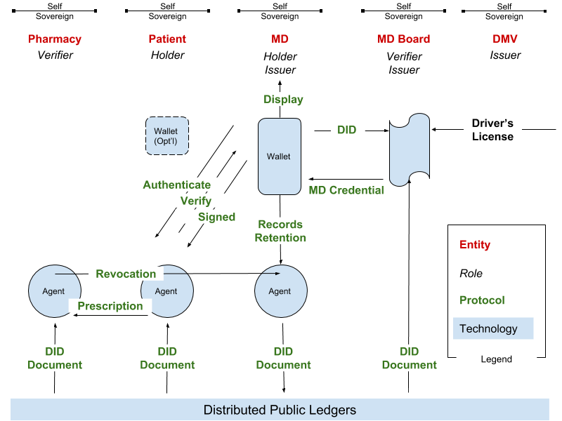

# Agent Protocols

>Rebooting Web of Trust 7

Adrian Gropper, Arturo Manzaneda

# Objective
We’re catalyzing a world where each self-sovereign entity has **agent technology** and **decentralized governance** 
enables self-sovereign groups to compete for the participation of the self sovereign entities.

# Deliverables
The paper will name actors and the protocols that connect them in the context of the Prescription Use-Case. 

# Assets/Prior work
The Prescription Use-Case is  implied in the RWoT7 topic paper:  [Standards for Agency and Decentralized Information 
Governance - Early Experience](https://github.com/WebOfTrustInfo/rwot7/blob/master/topics-and-advance-readings/standards-for-governance.md)
by Adrian Gropper, MD, Michael Chen, MD, and Lydia Fazzio, MD. which is about a health 
record for the homeless in Atlanta, GA. 

Another RWoT7 topic paper [Digital Identity for the Homeless](https://github.com/WebOfTrustInfo/rwot7/blob/master/topics-and-advance-readings/Digital-Identity-for-the-Homeless.md) 
by Matthew Wong, T. Tian & CG Chen discusses a related issue.

# Audience
The paper is intended for developers of protocol standards and for CEOs looking to apply these standards in their 
business model.

# Key Points
Interoperable self-sovereign technology stacks looking for sustainable business models
* Five **Entities** (Roles)
    * DMV (Issuer)
    * Medical Board (Issuer, DMV Verifier)
    * MD (Holder, Prescription Issuer)
    * Patient (Holder)
    * Pharmacy (Verifier)
* Two **Verifiable Credentials**
    * MD License
    * Prescription
* Three **Agents**
    * Patient
    * MD
    * Pharmacy
* MD as Issuer has a **Verifiable Display** of the prescription
* Pharmacy AND Patient together can **Revoke** the prescription (no double spending)

# Outline

## Abstract
The term agent has been used in many contexts within the self sovereign identity world. But what exactly do we mean by 
an agent? This paper will try to summarize the agent concept and at the same time identify the main phases and messages
they need to exchange in order to be able to connect, receive credentials, and share proofs. We will start by assuming 
the discoverability of those agents, and leave that out of scope, for now.

**Message Families**
* Establish a secure connection
* Attestation: Receiving Credentials
* Verification: Sharing Proofs
* Consent: How are you going to use my data? data retention? policies?
* Error handling: How we manage errors in the asynchronous interactions

## Context Ideas
* Agent Definition
* Phases
    * Discovery (DID Resolver)
    * Connect
    * Transact

## Entity Diagram

## Some Standards
* W3C Verifiable Credentials
* W3C DID
* Kantara UMA
* IETF OAuth2
* …. what else?

## Discussion and Future Work
Protocol standards can be harmonized in the context of self-sovereign technology stacks representing each of the 
entities for a particular use-case. This model can be used to elucidate value-added services that will get investment 
and accelerate the adoption of protocol standards. This model can also be a foundation for decentralized governance.

## Impact
* Our use of terms such as wallet and agent becomes more precise.
* Protocol standards are scoped and layered to accommodate diverse business models.
* Standards participation, implementation, and release is accelerated.
* Self-sovereign technology stacks come to market sooner.
* Decentralized governance rescues civilization.
