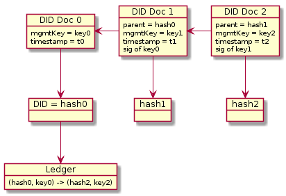

# IPLD as a general pattern for DID documents

*By Christian Lundkvist*

## Description

[IPLD](https://ipld.io) is a way of representing hash-linked data to be used in content-addressed data retrieval systems like [IPFS](https://ipfs.io). We investigate using IPLD as a general pattern in creating DID methods. The main idea is to represent an initial DID document as IPLD data, and then define the DID itself as the hash of this data. This way resolving the initial DID document from the DID is tautological - the DID is merely a representation of the data in the DID document.

Note that the DID document is not complete since in this case the DID document cannot contain the DID itself. A placeholder such as `did:example:this` would need to be put in whenever the DID appears in the DID document, but it is trivial to derive the complete DID document from the template.

As it stands this is also not a self-contained DID method because the DID document is immutable. Modifying the DID document would modify its hash, thus creating a new DID. We can however create a new DID document and link it back to the initial DID document, thus creating a cryptographic link back to the original DID.

The initial DID document needs to contain information about where to discover the latest version of the DID document. For instance, in the [muPort](https://github.com/uport-project/muport-core-js) DID method an Ethereum smart contract is used to point to the hash of the latest version of the DID document, and the document can be retrieved using the content-addressed IPFS system. In the [IPID](https://github.com/jonnycrunch/ipid) DID method the IPNS system can used to point to the latest version of the DID document, by means of a published signed statement. The [Sidetree](https://github.com/decentralized-identity/did-methods/blob/master/sidetrees/explainer.md) DID method uses a scalable Merkle data structure that aggregates multiple DID document updates in a Merkle Tree and publishes the root hash in a blockchain such as Bitcoin or Ethereum. A sidetree node can use these data structures to aggregate the updates into a complete DID document.

One large advantage of the IPLD approach described here is that the identity owner does not need to use a blockchain when initially creating an identity, thus making creation of identities fast and low cost (if not free). The DID and DID document will be cryptographically coupled by hashing. Only when the identity owner needs to update their DID document will they need a more costly tool such as a blockchain.

## Use for microledgers and pairwise identifiers

The IPLD pattern may be good to use for pairwise identifiers. A pairwise identifier is a DID that is meant to be used only with one other entity. The idea is that when setting up a pairwise DID you can do it by generating the DID document, and send the DID as well as the DID document to the counterparty.

Since there is only one actor that needs to agree on the mapping from DID to DID document, there is no need to use a blockchain or similar consensus mechanism in this case. The phrase "microledger" is often used to describe the way that these kinds of pairwise DIDs are handled.

The counterparty can verify that the DID document hash is the DID. Then if the user decides to update the DID document (normally through the use of a digital signature from a "management key" specified in the DID document) they can just present the updated version of the DID document to the counterparty who can then verify the signatures and store the updated document in a local database.

Even though IPFS could be used for content addressing there would not be a need to connect to a wider IPFS network. The "ledger" in this case could just be a simple database hosted by the counterparty.

