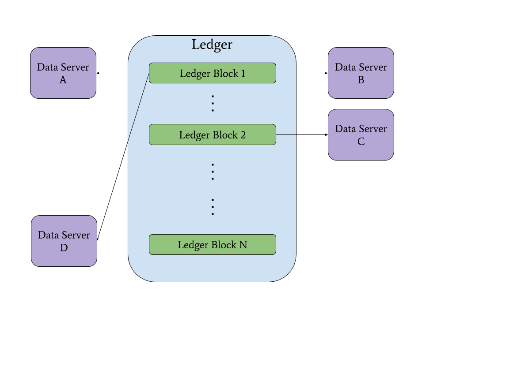

# Resource Integrity Proofs
> Cryptographic hyperlinking provides discoverability, integrity, and scheme agility


Contributors: Ganesh Annan, Manu Sporny, Dave Longley, and David Lehn


## Introduction
Currently, the Web provides a simple yet powerful mechanism for the dissemination of information via hyperlinks. Unfortunately, there is no generalized mechanism that enables verifying that a fetched resource has been delivered without unexpected manipulation. The [Subresource Integrity](https://www.w3.org/TR/SRI/) standard limits this guarantee to script and link resources loaded on Web pages via the use of HTML attributes. [IPFS](https://ipfs.io/) provides a verification mechanism that is constrained to hash-based, content-addressable links with no ability to complete content negotiation. Another mechanism that cannot be applied to existing links is proposed by [RFC6920](https://tools.ietf.org/html/rfc6920); it recommends the use of named information hashes and a resolution method that creates a content addressable URL [[1](#1-example-from-naming-things-with-hashes-rfc6920)].

This paper proposes a hyperlinking solution that decouples integrity information from link and resource syntaxes, enabling verification of any representation of a resource from any type of link. We call this approach Resource Integrity Proofs (RIPs). RIPs provide a succinct way to link to resources with cryptographically verifiable content integrity. RIPs can be combined with blockchain technology to create discoverable proofs of existence to off-chain resources.

## Features

### Integrity
Resource Integrity Proofs use the representation of a resource as the input to a cryptographic hash function to generate a digest value. We can reproduce the digest value because the RIP data model requires one to record the content type and digest algorithm. Third parties can easily verify data received by 1) dereferencing the URL of the desired resource and 2) using the digest algorithm on the data to generate a matching digest value to ensure that the data was not unexpectedly manipulated. The content received is now tamper-evident. RIPs may be placed on blockchains to simultaneously enable discoverability of off-chain resources and establish a proof of existence.

### Discoverability
Resource Integrity Proofs allow any party to find a given resource. This is achieved simply by including the URL of the resource in the data model. RIPs may be placed on blockchains to enable discovery of data whilst keeping sensitive data off-chain (i.e., private and secure).

### Scheme Agility
Resource Integrity Proofs make no assumptions on the URL scheme used. This scheme agility means that one can enable verification of the integrity of a resource using any URL scheme with any content type.

## Exemplary Use Case

### Meeting Regulatory Compliance
Organizations must provide documentation to regulators in order to maintain compliance.

We can implement software to meet the full requirements of this use case by adding RIPs to the already composable Lego-like ecosystem of interoperable decentralized technologies such as DIDs, VCs, and OCAPs -- and by combining this ecosystem with a cryptographically auditable system, such as a blockchain.

When an organization is preparing supporting documentation to meet compliance, they can post one or more RIPs and an OCAP for accessing each resource to a blockchain. This OCAP only grants access to the regulator and only to the specific items and for the duration that they need. Posting the RIP to a blockchain enables discoverability of the resource and establishes a proof of existence. The tamper-evident characteristics of the blockchain prove that the data existed at some point in the past, establishing trust via the cryptosystem rather than requiring it in the organization. The regulator then uses the delegated OCAP to dereference the url in the RIP and to ensure the data was not changed since the time of submission.


## Data Model
The Resource Integrity Proof (RIP) is a data model built using the [Linked Data Proofs](https://w3c-dvcg.github.io/ld-proofs/) specification. It can be represented using many different syntaxes; examples are given here in JSON-LD, N-Quads, and in a simple table.


**id**
> The location of the resource.

**proof**
> The Linked Data digital proof.

- **type**: The URL identifying the digital [proof suite](https://w3c-dvcg.github.io/ld-proofs/#dfn-proof-suite).
- **contentType**: The content type for the resource.
- **digestAlgorithm**:The cryptographic hash function used to generate the digestValue.
- **digestValue**: The output value of the resource generated by the digestAlgorithm.

**JSON-LD Syntax**
``` json
{
  "@context": "https://w3id.org/security/v2",
  "id": "https://example.com/storage/ndBRHU8gqjRzkcRdrPC2XQ",
  "proof": {
    "type": "MessageDigest2018",
    "contentType": "application/json",
    "digestAlgorithm": "sha256",
    "digestValue": "I1HMBrf9_K9aprW11YTQrKefEzmjpI6OW0adDpMRbwo"
  }
}
```

**N-Quads Syntax**
```
<https://example.com/storage/ndBRHU8gqjRzkcRdrPC2XQ> <https://w3id.org/security#proof> _:b0 .
_:b0 <http://schema.org/contentType> "application/json" .
_:b0 <http://www.w3.org/1999/02/22-rdf-syntax-ns#type> <https://w3id.org/security#MessageDigest2018> .
_:b0 <https://w3id.org/security#digestAlgorithm> "sha256" .
_:b0 <https://w3id.org/security#digestValue> "I1HMBrf9_K9aprW11YTQrKefEzmjpI6OW0adDpMRbwo" .
```

**Table**
<table id="table" class="table table-condensed">
  <thead>
    <tr>
      <th>Subject</th>
      <th>Predicate</th>
      <th>Object</th>
      <th>Graph</th>
    </tr>
  </thead>
  <tbody>
    <tr>
      <td>
        <a href="https://example.com/storage/ndBRHU8gqjRzkcRdrPC2XQ">https://example.com/storage/ndBRHU8gqjRzkcRdrPC2XQ</a>
      </td>
      <td>
        <a href="https://w3id.org/security#proof">https://w3id.org/security#proof</a>
      </td>
      <td>
        _:b0
      </td>
      <td></td>
    </tr>
    <tr>
      <td>
        _:b1
      </td>
      <td>
        <a href="http://www.w3.org/1999/02/22-rdf-syntax-ns#type">http://www.w3.org/1999/02/22-rdf-syntax-ns#type</a>
      </td>
      <td>
        <a href="https://w3id.org/security#MessageDigest2018">https://w3id.org/security#MessageDigest2018</a>
      </td>
      <td>
        _:b0
      </td>
    </tr>
    <tr>
      <td>
        _:b1
      </td>
      <td>
        <a href="https://w3id.org/security#digestAlgorithm">https://w3id.org/security#digestAlgorithm</a>
      </td>
      <td>
        sha256
      </td>
      <td>
        _:b0
      </td>
    </tr>
    <tr>
      <td>
        _:b1
      </td>
      <td>
        <a href="https://w3id.org/security#digestValue">https://w3id.org/security#digestValue</a>
      </td>
      <td>
        I1HMBrf9_K9aprW11YTQrKefEzmjpI6OW0adDpMRbwo
      </td>
      <td>
        _:b0
      </td>
    </tr>
  </tbody>
</table>

## Appendix

#### [1] Example from Naming Things with Hashes ([RFC6920](https://tools.ietf.org/html/rfc6920))

Using an **Authority** of `example.com` and the **sha-256 hash** of the text `"Hello World!"` we can generate the following ni URI:

`ni://example.com/sha-256;f4OxZX_x_FO5LcGBSKHWXfwtSx-j1ncoSt3SABJtkGk`

The generated ni URI takes advantage of the .well-known URI ([RFC5785](https://tools.ietf.org/html/rfc5785)) format so that we can dereference the information using HTTP(S):

`http://example.com/.well-known/ni/sha-256/f4OxZX_x_FO5LcGBSKHWXfwtSx-j1ncoSt3SABJtkGk`

#### [2] Diagram of Data Servers and a Ledger




