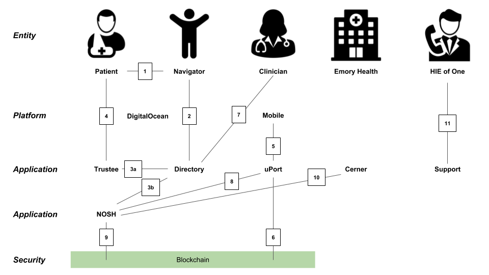

**Standards for Agency and Decentralized Information Governance - Early
Experience**

Adrian Gropper, MD, Michael Chen, MD, Lydia Fazzio, MD

#### **Introduction**

The many challenges to sharing and use of personal information are well
illustrated by the recent Facebook / Cambridge Analytica scandal. Opaque
and unaccountable concentration of governance over the personal
information of over 2 Billion people into one for-profit data broker has
societal impact on a global scale. This loss of individual agency can be
reversed through self-sovereign technology for control of personal data
\[Allen16\].

Individual control of personal information use, at scale, requires
standards and automation. Standards enable the service providers that
seek to use personal data to do that cost-effectively across the
population. Automation ensures that data flows on-demand without the
annoyance and delay of constant interaction with the data subject.
Appropriate standards and automation transfer personal data away from
data brokers and redistribute the value to the subject and the user of
the data. Privacy and the economy are both enhanced.

Health records are uniquely well suited for self-sovereign agency and
decentralized information governance because they drive almost 20% of
the US economy through the interaction between self-sovereign patients
and self-sovereign licensed clinicians. Before computers, the
paper-based transactions between patients and clinicians were not
mediated by any institution. With the advent of practical
standards-based self-sovereign technology, the agents of patients and
licensed clinicians can restore this direct relationship. Health data is
immensely valuable to both the individual and to society. Roche recently
paid about \$2,000 each for a million cancer patient’s records
\[Roche\].

Our HIE of One (for health information exchange of one) Trustee project
is an implementation of current standards and standards-track
**technologies for human agency and decentralized information
governance**. To be self-sovereign and practical, the Trustee agent must
not only be entirely under control of the individual, but the agent must
also be acceptable to the institutions that sell goods and services to
the individual. In this paper, we describe the design of a
self-sovereign health record for the homeless and our interaction with a
major academic medical center that will need to work with it.
\[HIEofOne\]

**Fig. 1 - Homeless Health Record Interaction Diagram** 
_The numbered lines are in order of agent creation (1-4) and agent use (5-10)_

#### **Online Presence -** Digital Ocean VM with fixed IP, Self-Hosted Appliance, Intel SGX

A personal agent should be accessible as a service 24x7x365. Mobile
devices are not designed to fill this requirement. Self-hosting in a
person’s home alongside their router would be ideal but current Internet
service provider practice makes keeping a server at home difficult for
the average person. This is especially true for the homeless.
Nonetheless, we continue to track self-hosting initiatives such as
FreedomBox and UBOS \[Self\].

The initial release of Trustee is hosted on a separate virtual machine
for each person. Although this represents a \$5/month cost, it’s
essential for a self-sovereign system that serves only you and can be
owned entirely by you. We use DigitalOcean as the hosting provider. The
open source software can be adapted to other hosts as long as provision
is also made for technical support.

#### **Agent Endpoint - DNS Registrar**

Your self-sovereign agent, your Trustee, needs to be reachable, wherever
you decide to host it. To make it routable it needs an entry in the
domain name system (DNS) or equivalent functionality. Self-sovereign
routing is not practical quite yet although there are projects underway
such as IPNS that could provide a blockchain-friendly decentralized
alternative in a few years \[IPNS\].

For now, each Trustee needs a domain or subdomain. If you already own a
domain, you can add a Trustee sub domain for free. If you don’t own a
domain, the website that helped you get your Trustee probably created a
subdomain for you automatically.

For patients, there is a privacy issue to consider when you establish a
Trustee service endpoint that is to be shared across multiple service
providers. You can protect against correlation across service providers
by using different identifiers but it is very difficult to use separate
agent endpoints. Large cloud service providers might mitigate this by
offering separate subdomains that obscure the actual agent endpoint but
these are not available yet. Although not a truly self-sovereign
solution, such a service provider would be incentivized to protect the
privacy of their customers.

#### **Decentralized Identifiers** - uPort, Single Sign-On, DID Auth, OpenID Connect

Access to the agent-controlled resources requires standardized single
sign-on methods since would-be data users (requesting parties) cannot be
expected to establish separate credentials with each patient. Trustee
supports both self-sovereign (DID Auth) and federated (OpenID Connect)
authentication \[DIDAuth\].

DID Auth supports self-sovereignty for the requesting party but requires
them to install mobile apps and manage multiple credentials (see below).
Federated authentication is less demanding of the requesting party as
long as they trust the identity provider to preserve their interests.

In our homeless health record (HHR) example, some medical centers choose
to operate OpenID Connect servers while others do not. Individual
requesting parties can choose to sign-in to Trustee using OpenID Connect
or DID Auth (to preserve their self-sovereignty) as long as the patient
(also self-sovereign) has whitelisted the requesting party’s identity
provider or has whitelisted the credentials linked to the self-sovereign
ID.

The homeless health record institution we’re working with in Atlanta has
not yet decided if they will operate an OpenID Connect server or not.
Either way, their choice will not restrict the self-sovereignty of
either their clinicians or the patients.

#### **Verifiable Credentials** - Doximity, Attribute-based Access Control, Accountability

A citizen’s (the homeless person, in this case) agent evaluates requests
for access to personal data (e.g.: health records, service eligibility)
on the basis of scoped requests by specific individuals. The individual
presents credentials linked and secured through their decentralized
identifier or, in the case of OpenID Connect, presented via the Identity
Provider. The agent will issue an authorization based on the requested
scope, the credentials, and the stored policies set by the citizen.

In the HHR example, the requesting party’s decentralized identifier is
based on the uPort app and the Ethereum blockchain. The app is
effectively a credential wallet under the control of the requesting
party. The primary credential for the HHR pilot is currently that the
party is a physician as verified by the Doximity social network service.

There are multiple ways for a physician with a uPort wallet and a
Doximity account to add this credential. The process we use is not yet
based on the W3C standards and may not be sufficiently secure for
general use of the credential. The attachment of the Doximity credential
to a particular uPort is mediated by the Directory (described below).
Other Trustees will then see this credential and could, in theory verify
it themselves. We have not implemented verification of the credential as
this will be eventually under the control of uPort or another
standardized identity wallet.

The (public) credential is what keeps the requesting party accountable.
It implies that misuse of authority to access the patient’s records can
be proved based on transaction records retained by the Trustee and
timestamped to the Ethereum blockchain. This preserves the
self-sovereign peer-to-peer relationship between the patient and the
physician.

#### **Agent Software - HIE of One Trustee** - Free Software, UMA, FHIR

The patient’s agent is built around a standard authorization protocol
called UMA (for User Managed Access). UMA builds onto the well-known
OAuth2 protocol for securing a resource server API to enable the
operation of the authorization server by an entity independent of the
resource server. It is this separation of concerns (resource server from
authorization server) that makes possible a self-sovereign agent of the
patient.

Technically, a self-sovereign agent must be the exclusive delegate of
the patient. That includes enabling a patient that so-chooses to modify
and compile the agent software from source. All of the components of HIE
of One are Free Software under the GPL license.

Another key aspect of self-sovereignty is the avoidance of a walled
garden. We depend on open standard protocols to enable the patient and
to work with a range of resource and authorization servers who must, in
effect, compete for the patients. Aside from UMA, the HHR implements the
HL7 FHIR data model and API.

#### **Trustee Directory** - Decentralized Information Governance, Privacy Policy, Support

Self-sovereign peer-to-peer interactivity does not provide two other
essential features of mediated interaction: end user support and
information governance for discoverability. HIE of One created Trustee
Directory software to enable a community group or business to offer
these services to Trustee owners. The Directory is also Free Software
and self-sovereign to the group that owns it.

The Directory operator determines their privacy policy and terms of use
to promote the mission of the group, which may include various business
models for donating or monetizing patient data subject to concurrence by
each individual Trustee authorization server. When a new Trustee is
created with support from a Directory operator the authorization server
is initialized with the policies defined by that group as entered in
their Directory. At that time, the Trustee account is still empty of any
private information and the patient can change or modify the initial
policies before they enter any private information that the Directory
would share.

We call this Decentralized Information Governance. Unlike current
practice that locks patients into the policies of a government (typical
of European national registries), a large hospital network (typical of
the US large hospital model), or a corporation (e.g.: Google or IBM as
transnational health records aggregators), Trustee patients can freely
choose one or more Directories to support and add value to their data.
This forces various Directories around the world to compete for both
patients and users on the basis of their governance and policies.

#### **Academic Medical Center** - Emory Homeless Health Record, Compliance, Funding

Trustee is working with clinical researchers at Emory Healthcare (an
academic medical center) to demonstrate a health record for homeless
patients. This research project is led by the psychiatry department in
collaboration with the computer science department and the health
records services department. The homeless are high utilizers of
healthcare services and have a disproportionately large share of mental
health issues. It is hypothesized that a self-sovereign design will
engender trust, promote interoperability across different regional
providers, and improve the value of care delivered to this vulnerable
population.

The project is designed in two phases. Phase 1 is all about
determination of the relationship between the self-sovereign patient
technology and the technology controlled by the institution. It has
budgeting, project management, and compliance components. Phase 1 will
also determine which entity operates the Directory and will provide
end-user support. Phase 1 is primarily about risk management.

Phase 2 is the clinical phase which includes clinicians from Emory
Healthcare as well as other providers in the region and possibly a
community service group in the role of navigator for the homeless
patients.

The two phases are expected to last 3 and 6 months, respectively. With
additional delay related to grant funding. Phase 1 is already under way.

#### **US Federal Government - Medicare -** OAuth Proxy

The US Federal Government is another significant holder of personal data
subject to a right of access by the data subject. In particular,
Medicare keeps health insurance records for a large fraction of the
population and has been actively promoting patient access and
patient-directed access under the Blue Button 2.0 initiative \[BB20\].
This is an opportunity for testing the compatibility of self-sovereign
technology with the policies and practices of a major government agency.

HIE of One Trustee is a participant in Blue Button 2.0 and has
implemented compatibility with the Medicare sandbox. Medicare did not
consider self-sovereign patients in the initial BB2.0 design which
currently requires a multi-week and very expensive certification process
for each Trustee client app that would connect to the Medicare
production API. This is obviously impractical. In order to enable a
tolerable user experience we have implemented an OAuth2 proxy at the
Directory so that only each Directory needs to be certified. This makes
sense to the extent that each Directory has a privacy policy which is
the key to the rest of the certification process. (NB: Individual
Trustees do not have nor do they need a privacy policy because you can’t
have a privacy policy with yourself.) We have applied for production
access, demonstrated Trustee, answered a series of questions and are
awaiting certification.

The result of the Medicare access process will inform other projects
seeking to gain access under a patient right of access, including under
GDPR Article 15 \[GDPR15\].

#### **Corporate Structure and Finance -** Public Benefits Corporation

Lastly, the HIE of One project is testing ways to achieve sustainability
and scale for self-sovereign technology. Finance is a challenge for a
project that insists on Free Software licenses and open standards to
facilitate substitutability. Our project is organized around an open
source repository managed by Michael Chen and a Delaware (US) Public
Benefits Corporation controlled by Adrian Gropper. There are no outside
investors at this time and no formal management structure. Trustee is a
registered trademark of HIE of One.

The corporate structure is useful for dealing with expenses such as
hosting and user support during the development phase as well as the
liability of operating Directory and support services. Although Michael
and Adrian are both physicians, the Trustee project does not use or
depend on their professional credentials.

In many respects, and somewhat by design, HIE of One Trustee is
structured like many public blockchains with open source code, open
participation, public planning, and very limited intellectual property
protections. The focus is on implementation first and policy constraints
are limited.

The sustainability of the HIE of One Trustee model for self-sovereign
technology is still to be determined. The project could be seen as a
“fat protocol” \[FAT\]. We look forward to ongoing discussion of
financing models as the utility of Trustee itself becomes demonstrable
and limited clinical use commences.

#### **Next Steps -** Apple Health, Backup, Record Retention, Payment

The roadmap to limited clinical use still has a few milestones:

-   The patient’s user experience needs to be on par with Apple Health
    > as long as all the user expects is to connect and view her
    > health records. One way to achieve this is to use Apple Health
    > itself in those cases where it already offers the functionality.
    > Apple Health is not self-sovereign by our working definition but
    > at least it does not seem to compromise privacy. The plan will
    > develop as we understand the constraints posed by Apple policy and
    > potential app developer collaborators are identified.

-   A user’s self-sovereign Trustee needs to be backed up. The MVP
    > backup strategy has not yet been specified or implemented.

-   Licensed users of a patient’s Trustee are subject to records
    > retention requirements. They could, of course, just keep a paper
    > notebook but this hardly seems practical. We’re investigating a
    > simple records retention solution.

-   Long-term operation of Trustee will require some means of support
    > for the accounts, at least for the hosting component. This could
    > be as simple as documenting the way a patient can get their own
    > DigitalOcean account and then pay for HIE of One support a
    > la carte. Other solutions will be considered.

The HIE of One Trustee project is on track to become an example of
clinically useful standards-based self-sovereign technology by the end
of 2018. Please join us.

#### **References**

\[Allen16\]
[*https://github.com/ChristopherA/self-sovereign-identity/blob/master/ThePathToSelf-SovereignIdentity.md*](https://github.com/ChristopherA/self-sovereign-identity/blob/master/ThePathToSelf-SovereignIdentity.md)

\[Roche\]
[*https://www.forbes.com/sites/reenitadas/2018/02/26/flatiron-health-acquisition-a-shot-in-the-arm-for-roches-oncology-real-world-evidence-needs/\#40e651e53f60*](https://www.forbes.com/sites/reenitadas/2018/02/26/flatiron-health-acquisition-a-shot-in-the-arm-for-roches-oncology-real-world-evidence-needs/#40e651e53f60)

\[HIEofOne\] [*http://hieofone.org*](http://hieofone.org)

\[Self\] [*https://freedombox.org*](https://freedombox.org),
[*https://ubos.net*](https://ubos.net)

\[IPNS\]
[*https://www.w3.org/2016/04/blockchain-workshop/slides/benet-ipfs.pdf*](https://www.w3.org/2016/04/blockchain-workshop/slides/benet-ipfs.pdf)

\[DIDAuth\]
[*https://github.com/WebOfTrustInfo/rebooting-the-web-of-trust-spring2018/blob/master/final-documents/did-auth.md*](https://github.com/WebOfTrustInfo/rebooting-the-web-of-trust-spring2018/blob/master/final-documents/did-auth.md)

\[BB20\] [*https://bluebutton.cms.gov*](https://bluebutton.cms.gov)

\[GDPR15\]
[*https://gdpr-info.eu/art-15-gdpr/*](https://gdpr-info.eu/art-15-gdpr/)

\[FAT\]
[*https://www.usv.com/blog/fat-protocols*](https://www.usv.com/blog/fat-protocols)
